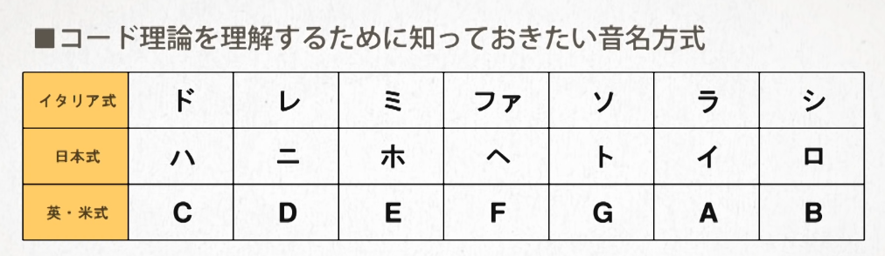

# 誰でもわかるコード理論

    種別：web
    プロジェクト：音楽
    開始１：2019/11/17
    終了１：yyyy/mm/dd
    開始２：yyyy/mm/dd
    終了２：yyyy/mm/dd

## メモ

### part01
音名
### part02

全全半全全全半
ナチュラル・マイナー・スケール
全半全全半全全
平行調
Cメジャースケール → Aナチュラルマイナースケール

同主調
Cメジャー → Cナチュラルマイナー

4半音 - 3半音

11半音
10半音

part06まで終わった  

## part07

## NEXT

## LOG

- 2020/11/17 part06

## back

[目次](../README.md)

